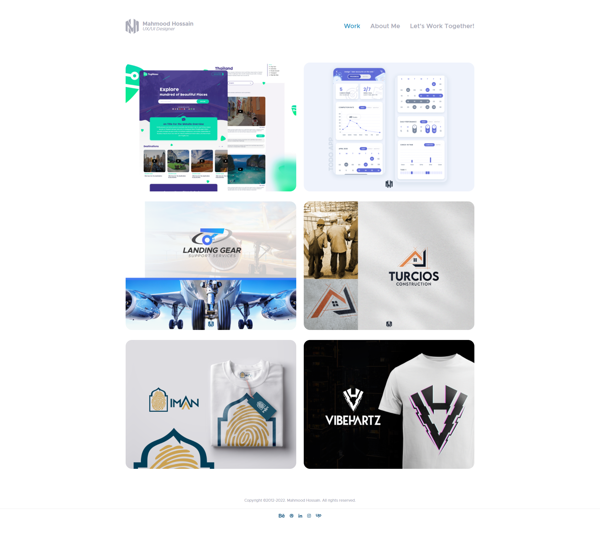
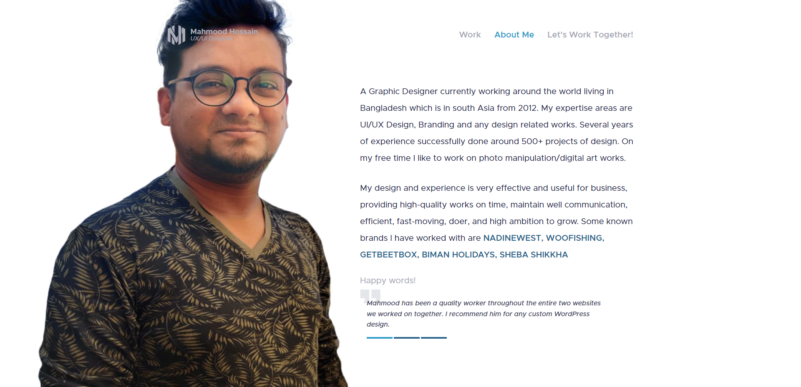
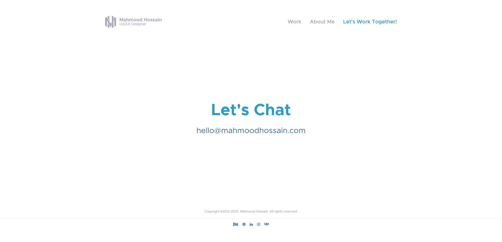
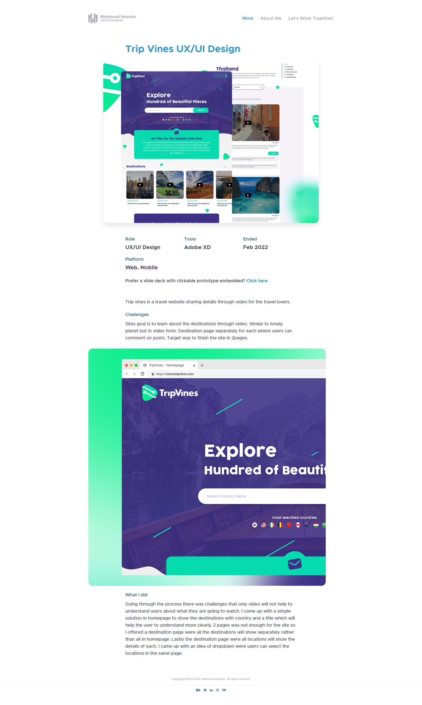

<!-- PROJECT LOGO -->
 

  

<h3 align="center">Mahmood Hossain</h3>

  

    A simple portfolio website.
     
    <a href="https://github.com/ihossain9595/mahmood-hossain-v2"><strong>Explore the docs »</strong></a>
  

<!-- TABLE OF CONTENTS -->

  
Table of Contents

  <ol>
    <li><a href="#about-the-project">About The Project</a></li>
    <li><a href="#built-with">Built With</a></li>
    <li><a href="#contact">Contact</a></li>
  </ol>

<!-- ABOUT THE PROJECT -->
## About The Project

  <ol>
    <li></li>
    <li></li>
    <li></li>
    <li></li>
  </ol>

Omnifood is an AI-powered food subscription that will make you eat healthy again, 365 days per year. It's tailored to your personal tastes and nutritional needs. 
PS - This is the first website that I have created. Thanks to Jonas Schmedtmann (@jonasschmedtman).

(<a href="#top">back to top</a>)

<!-- BUILD WITH -->
## Built With

* [HTML]
* [CSS]
* [JavaScript]

(<a href="#top">back to top</a>)

<!-- CONTACT -->
## Contact

Ismail Hossain - [@ihossain9595](https://twitter.com/ihossain9595) - ihossain9595@gmail.com

Project Link: [https://github.com/ihossain9595/mahmood-hossain-v2](https://github.com/ihossain9595/mahmood-hossain-v2)

(<a href="#top">back to top</a>)

[product-screenshot-1]: img/screenshot-1.png
[product-screenshot-2]: img/screenshot-2.png
[product-screenshot-3]: img/screenshot-3.png
[product-screenshot-4]: img/screenshot-4.png
